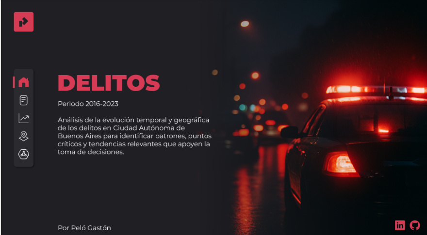
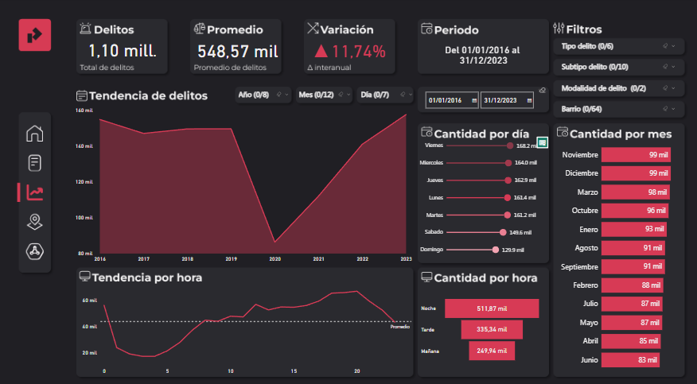
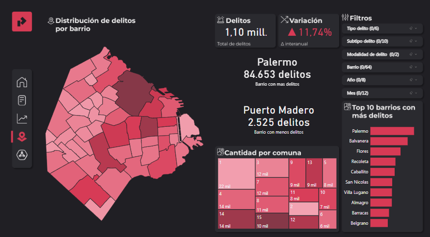

# Análisis de Delitos en la Ciudad Autónoma de Buenos Aires (2016-2023)

Este proyecto fue desarrollado como Trabajo Final de la diplomatura en "Análisis de Datos" de la Universidad Nacional de Jujuy.  

El objetivo principal fue identificar zonas de concentración delictiva (hotspots) y analizar cómo varían en el tiempo y el espacio, incluyendo su relación con puntos de interés como escuelas, comisarías, estación de bomberos, universidades, hospitales y bibliotecas.

## 📌 Objetivos del proyecto

El objetivo de este proyecto es analizar y comprender la distribución de los delitos en la Ciudad Autónoma de Buenos Aires (CABA) entre 2016 y 2023 para identificar áreas de alta incidencia delictiva.
Como objetivo final este análisis nos permitirá identificar patrones que contribuirán a la 
formulación de estrategias de prevención y optimización de la seguridad pública.

A futuro, se plantea la posibilidad de desarrollar un análisis operativo diario, permitiendo una  
toma de decisiones en tiempo real para la gestión de la seguridad.

## 🛠️ Herramientas utilizadas

- Excel
- Power BI
- SQL
- Python: Panda, Scikit Learn
- Gimp
- Adobe InDesign 

## 📊 Dashboards de Power BI

## 📈 Resultados destacados
Como hipótesis inicial nos planteamos que la cercanía a ciertos puntos de interés podría influir en los hechos delictivos.
A lo largo del análisis,  pudimos cruzar la ubicación de más de un millón de delitos registrados con la ubicación de puntos de interés como comisarías, escuelas, etc.
Si bien observamos que las escuelas presentan una mayor cantidad de delitos cercanos, esto se debe en gran medida a que en los puntos de interés analizados, las escuelas superan en número a los demás. Por lo tanto, no se puede afirmar una relación causal o directa con los delitos.
En conclusión, el análisis no pudo confirmar completamente nuestra hipótesis planteada pero abrió nuevas líneas para seguir analizando en un futuro.

## 🏆 Evaluación

✅ **Calificación final**: 100/100  
📝 **Comentario**: Evaluado como *trabajo de excelencia* por el equipo docente.

